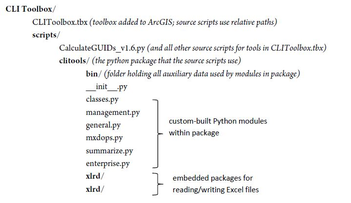
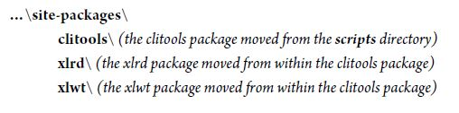

### *APPENDIX D: Python Installation Notes*

The code used for all of the tools is written in Python 2.7. The structure of the CLI Toolbox was designed to meet four criteria:

  1. Create a package that allows various tools and functions to reuse the same code
  1. Include the xlrd and xlwt packages to allow for the creation of MS Excel workbooks
  1. *Do not* require the user to install third-party Python packages or know what that means
  1. Produce a structure that will facilitate future development and extended functionality for advanced GIS users.
  
In order to meet the first goal, a new Python package was developed called “clitools” to hold all of the new classes and functions that are used by the tools in the toolbox. The second goal was met by embedding these two packages in the new clitools package. The xlrd and xlwt modules were developed by David Giffin <david@giffin.org>, and they are freely distributable under a 4-clause BSD-style license (thanks Mr. Giffin!). The third goal was achieved by packaging all of this code in a way that it is easily accessible by all of the source scripts for the tools, and by setting all of the tools in the toolbox to look for relative paths to their source scripts. That way, wherever the **CLI Toolbox** folder is moved to, all of the tools will find the correct source scripts, and all of those source scripts will successfully import the necessary functions from within the clitools package.

Finally, the fourth goal was achieved by setting everything up to allow a future developer to move the clitools package into the local Python installation, without having to modify any code. When this is done, all of the functions and classes in the clitools package are available to any new Python application, as well as the Python console that is available in ArcMap and ArcCatalog.

See the following page for a more detailed explanation of the file structure, and an explanation of how to move the clitools package to the local Python installation.

CLI Toolbox/
CLIToolbox.tbx (toolbox added to ArcGIS; source scripts use relative paths)
scripts/
CalculateGUIDs_v1.6.py (and all other source scripts for tools in CLIToolbox.tbx)
clitools/ (the python package that the source scripts use)
bin/ (folder holding all auxiliary data used by modules in package)
__init__.py
classes.py
management.py
general.py
mxdops.py
summarize.py
enterprise.py
xlrd/
xlrd/

All of the \*.py files in the scripts folder import standard python libraries, or specific functions from the adjacent clitools package. For example, the CalculateGUIDs_v1.6.py script uses this statement:

import os

from clitools.management import CreateGUIDs

All of the actual functions for all of the tool operations are defined in the modules in the clitools package (classes.py, management.py, etc.). A few of these functions import the xlrd or xlwt modules using this standard import statement:

import xlrd

import xlwt

By embedding all of these packages within the toolbox folder, the user need not modify their local Python installation to use the new clitools module or the third-party xlrd and xlwt modules.

This means that all of the functionality in the clitools package is available with normal import statements for any \*.py file that is located in the **scripts** directory. However, for any user interested in adding the clitools package (or xlrd and xlwt packages) to their local Python installation so the functions are available to any script anywhere, the conversion is very simple:

  1. *Move* the entire clitools package to the local Python site-packages directory
  1. *Move* the xlrd and xlwt packages from within the **clitools** folder to the local Python site-packages directory

*(best practice would be to copy the packages, paste them to the site-packages directory, and after they have imported correctly (see below) delete the entire clitools package in the scripts directory)*

The resulting structure of the site-packages directory will look like this:

…\site-packages\
clitools\ (the clitools package moved from the scripts directory)
xlrd\ (the xlrd package moved from within the clitools package)
xlwt\ (the xlwt package moved from within the clitools package)

The site-packages directory is found here in standard Python installations:
C:\Python27\Lib\site-packages

or here when ArcGIS is installed:
C:\Python27\ArcGIS10.x\Lib\site-packages

To test whether the packages have been correctly moved to the local Python installation, open the start menu and type “idle” to start IDLE. In the console, try to import each new module by typing:

\>>> import clitools, xlrd, xlwt

If any import errors occur, remove all packages that have been copied to the site-packages directory and the start process over. When all three modules import without error, delete the clitools package from its original location in the **scripts** directory (if you are skittish about deleting things, you could just rename the clitools directory to “clitools1”). Because of the way the imports are constructed in each \*.py file, all tools and modules will continue to function as if nothing has changed. However, now all of the modules in the clitools package—classes.py, mxdops.py, general.py, management.py, enterprise, and summarize.py—can be imported to any Python applications or the ArcGIS console.

The following is an example of how to use the clitools MakeUnit function in IDLE to list the landscapes in a park (Sleeping Bear Dunes National Lakeshore):

\>>> from clitools.classes import MakeUnit\
\>>> unit = MakeUnit("SLBE")\
\>>> for landscape in unit.landscapes:
print landscape
     
\(u'450004', 'South Manitou Island Light Station')\
\(u'500003', 'Port Oneida Rural Historic District')\
(u'500330', 'North Manitou Island Life-Saving Station')\
(u'975462', 'Glen Haven')\
(u'975538', 'Bufka, Kropp, Eitzen Agricultural District')\
(u'975586', 'North Manitou Island - Cottage Row')

For more help on any function or module, try the following lines after the import statement in the example above has been used:

\>>> help(MakeUnit)\
\>>> help(clitools.classes)

Alternatively, all help from the documentation for the clitools modules and functions can be found in the **python documentation** folder.
