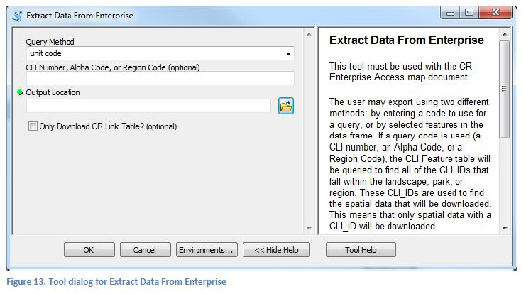

### PART 4: ACCESSING THE CULTURAL RESOURCE ENTERPRISE DATABASE

#### About the CR Enterprise Database

The CR Enterprise is a spatial database that is dedicated to storing cultural resource spatial data and serving it throughout the NPS network. Because the database functions as a repository, the CLI Toolbox is equipped with two tools that allow the user to analyze and download data from it. For the purposes of the CLI Toolbox, the only access to the CR Enterprise is through the layers in the CR Enterprise Access map document that is included in the toolbox. These layers are “views” of the corresponding feature classes in the enterprise database, which show only data that is marked as “Unrestricted”. Thus, it is important to note that when viewing the data in the CR Enterprise Access map document, or when downloading/making spreadsheet summaries of that data using the map document (see below), any data that is marked as restricted (at any level) will be omitted.

Only the designated regional data editors will have edit-access to the CR Enterprise. The intention with the tools in the CR Enterprise Access toolset is to allow for Cultural Landscapes Program staff (or any NPS staff) to get local copies of the data, which can be analyzed, updated, used for fieldwork, etc. The protocol for getting updated data from landscape or park staff to the regional data editors will vary significantly from region to region, but by using the tools in the CLI Toolbox, the new or updated data should be presented to the data editor in a complete and standardized format.

#### Summarizing CLI Data in the Enterprise Database

The presence or absence of CLI features in the CR Enterprise spatial data can be summarized using the **_Summarize CLI Data in Enterprise_** tool. The tool produces MS Excel spreadsheets that are similar to the output of the other spreadsheet summary tools in the Review Tools toolset (PAGE NO see pp. 25-27). Also similar to the other tools, the user may choose between creating a summary of a single landscape or of multiple landscapes.

  1. Open the CR Enterprise Access map document (found in the **CLI Tools** folder)
     1. You must be connected to the NPS network for the database connections to work. If you are on the network but still have connection issues, refer to the “readme” file in the **CLI Tools** folder.
  1. Open the **_Summarize CLI Data in Enterprise_** tool, inside the CR Enterprise Access toolset. The CLI Toolbox should already be added to the map document. If this is not the case, refer to the directions at the top of PAGE NO page 10.
  1. Choose whether you want to create a summary for a single landscape (which will list each feature), or a whole park or region (which will list each landscape). Enter a corresponding code.
  1. Select an output location for the spreadsheet.
  1. Click OK to run the process.

These are light-weight versions of the other spreadsheet tool outputs: In the single landscape summary, the type of geometry that represents each feature will not be shown, and there are no columns for tracking comments or editing operations. In the multiple landscape summary, the user does not have the option of omitting CLI features that are listed in the Archeological Site landscape characteristic, and must choose to list all of the landscapes in a park or region, not an arbitrary assortment of landscapes (e.g. a few different landscapes from a few different parks).

Creating these spreadsheet summaries is a good way to check on how many CLI features have spatial data in a given landscape, park, or region. This information will be useful in planning for future landscape work and on-the-ground data collection.

#### Acquiring Local Copies of Data from the Enterprise Database

It is therefore recommended that to edit, analyze, or distribute CLI data from the enterprise (all of which is, as mentioned above, unrestricted by nature of the connections to the database), a local copy should be made and used. To that end, the **_Extract Data From Enterprise_** tool was developed, which will create a local CLI Standards geodatabase from data in the enterprise. This tool gives the user two options for how the CR Enterprise should be queried: By unit code, or by using the currently selected features in the data frame. The latter option is provided in case the user would like to download features that do not yet have a `CLI_ID`. Alternatively, if the spatial data is not needed, the user can download just the CR Link table rows that correspond to the features that match the query method.

  

  1. Open the CR Enterprise Access map document (found in the **CLI Tools** folder)
     1. You must be connected to the NPS network for the database connections to work. If you are on the network but still have connection issues, refer to the “readme” file in the **CLI Tools** folder.
  1. Open the **_Extract Data From Enterprise_** tool, inside the CR Enterprise Access toolset. The CLI Toolbox should already be added to the map document. If this is not the case, refer to the directions at the top of PAGE NO page 10 to do so.
  1. Choose whether you want to query the database by using an input code or by selecting features.
     1. Enter a unit code if necessary, otherwise be sure to have selected all relevant features using any of the normal ArcMap selection methods.
  1. Select an output location for the resulting geodatabase.
  1. Click OK to run the process.
  
When the process is finished, the user will have a CLI Standards geodatabase with all of the data that matched the query. This geodatabase can be displayed with various display options (PAGE NO p. 23), summarized (PAGE NO p. 25-27), exported to a Google Earth file (PAGE NO p. 25), have program IDs added to its CR Link table (PAGE NO p. 21), etc. The process of rolling up edited (or new) CLI GIS data from a park or regional office into the CR Enterprise database is one that will vary region by region, and is ultimately determined by the designated regional data editors. Hopefully, regardless of the specifics, some tools from the CLI Toolbox will assist the process along the way.
