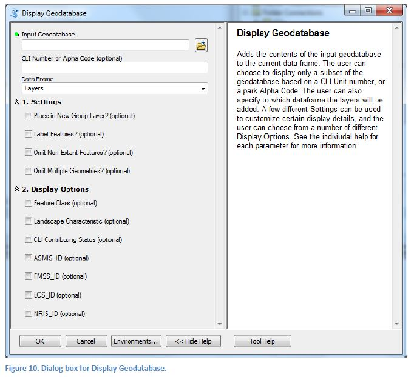
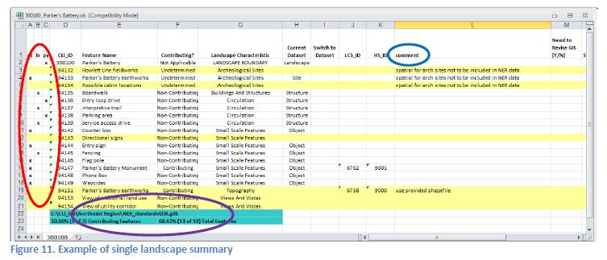
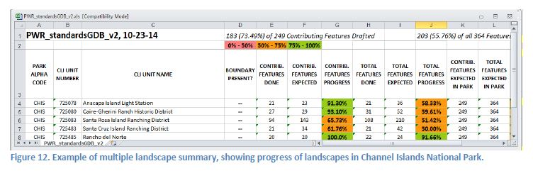

### PART 3: USING THE TOOLS TO DISPLAY AND REVIEW DATA

#### Displaying the Contents of a Geodatabase

One of the most useful ways that this data can be used is to display it with different symbology and layering schemes. Use the **_Display Geodatabase_** tool to do this. Either a CLI Standards geodatabase or a Scratch geodatabase can be displayed, though with a scratch geodatabase, the display options are significantly reduced (due to the lack of CR Link table). The **_Display Geodatabase_** tool must be run from ArcMap.

  1. Open the Display Geodatabase tool from ArcMap.
  1. Locate the geodatabase you’d like to display
  1. Enter a CLI Number or Alpha Code if you’d like to only display a subset of the geodatabase.
  1. Select any of the Settings that should be applied to the displayed data.
  1. Select one or more Display Options to determine what symbology and layering scheme will be used to display the contents of the geodatabase.
  1. Click OK to run the process.

Once an input geodatabase has been entered, the user may apply any of the settings desired, and may choose any number of Display Options. If more than one Display Options is chosen, they will each be placed in a separate group layer. The settings are fairly straight-forward, but the various display options deserve some explanation.

- **Feature Class:** This is the most basic display option: the tool will add a layer for each feature class in the geodatabase and apply a standardized color scheme. If the user plans to edit the geometry or add new features to the geodatabase, this option should be chosen alone. The reason for this is that all the other display options operate by adding multiple layers of the same feature class using different definition queries. This is awful for editing because 1. Creating new features in layers with existing definition queries is very cumbersome, and 2. The Update Records in Selected Features tool will not work if multiple layers in the table of contents have the same name.

- **Landscape Characteristic:** The features from the geodatabase are divided by Landscape Characteristic (using the `LAND_CHAR` field), and are added to separate group layers. This makes review of features very easy as the groups for each landscape characteristic can be turned on or off.

- **CLI Contributing Status:** New group layers are added to the table of contents for the following CLI contributing status categories:

  - Contributing
  - Non-Contributing
  - Undetermined
  - Unknown

The features are then sorted into the appropriate category. Here are a couple of important things to keep in mind:

  1.  In the spatial data, the CR Spatial Data Transfer Standards do not quite support these same values. Resources are either flagged as “Yes”, “No”, or “Unknown”. However, this Display Option uses each feature’s *CLI* contributing status, as the name indicates.
  
  1.  There are some values in the CLI that are not accommodated here, and will be sorted to the “Unknown” category. For example: “Non-contributing – compatible” which occurs in a few situations. However, “Non-contributing” and “Non contributing” are both placed into the “Non-Contributing” category.
  
- **Database ID Presence:** All of the final Display Options work the same way: “Yes ID” and “No ID” group layers are added and features are sorted into them based on whether that CR_ID has an associated program ID in the CR Link table. For example, you may display a CLI Standards geodatabase for an entire park, and use this option to see which features are linked to an FMSS ID in the CR Link table. You could then find all those that don’t have an FMSS ID, add the FMSS ID to the CR Link table (PAGE NO see p. 21), and then redisplay the geodatabase to see the change. These Database ID Presence options are not available if a scratch geodatabase is the input, due to a lack of a CR Link table.

#### Creating Google Earth Files 

The **_Create Google Earth File_** tool will convert a set of landscape GIS data into a file that is readable by Google Earth, a KMZ file (which is a compressed KML file). A KMZ file would not be used for editing data or adding features, but it is especially useful for distributing data to interested parties that may not have GIS capabilities.

KMZ files can best be viewed with either Google Earth or ArcGIS Explorer. Both of these applications are free and easy to use, and both come fully equipped with basemap aerial imagery and 3D terrain, which makes them a great way to view landscapes in their larger physiographic contexts. For help on how to use Google Earth, see the document titled “Tips for Using CLI Google Earth Files”.

All Display Options and most of the Settings that are available in the **_Display Geodatabase_** tool are also available in the Make Google Earth File tool. The tool works by using the **_Display Geodatabase_** operation on a blank map document, and then converting that map document to a KMZ using ESRI’s “Map to KML” tool (in the Conversion toolbox).

#### Creating Spreadsheet Summaries

There are two tools in the CLI Toolbox that will facilitate the creation of MS Excel spreadsheet summaries, which can be used to review the progress that has been made on a given landscape, park, or region. What should become very clear is that these spreadsheet operations are entirely based on the feature lookup tables that have been described above in the CLI Toolbox Concepts section (PAGE NO p. 7). It’s from these tables that lists of all expected features in a landscape, or all expected landscapes in a region, are made.

--SINGLE LANDSCAPE SUMMARY SPREADSHEET--

The **_Excel File Single Landscape_** tool will create a spreadsheet that lists every feature in a given landscape, and highlights any that don’t yet have spatial data in the geodatabase that is being analyzed. Example usage: You are working in a scratch geodatabase, and use this tool periodically to check your progress on getting spatial data for all of the features.

Above is an example spreadsheet summary, and despite the illegibility, one can still see that a few rows are highlighted. These are features that are listed in the CLI for this landscape, but do not yet have GIS data to represent them.

There are a few other aspects of the spreadsheet worth pointing out. Circled in red (on the left) is a set of hash-marks (Xs?) that indicate what type of geometry—point, line, or polygon—is currently being used to represent each feature. Circled in purple (bottom) is the path of the geodatabase whose spatial data has been summarized, as well as percentages of the expected contributing features and total features that have been represented with spatial data.

Circled in blue (top right) is the “comment” column. This column provides a storage place for comments about specific features, and is especially useful to hold explanations for a feature’s absence from the spatial data, or suggestions on where to find it. When creating a new spreadsheet summary, the user can select an existing spreadsheet from which the comments on each feature should be pulled and incorporated into the new one.

The intention is for ONE spreadsheet to exist for each landscape, within the landscape folder in the recommended directory structure. The tool dialog is set up to facilitate this use: When a CLI number is entered, the tool dialog will look for an existing spreadsheet for that landscape and enter its path in the Get Comments From… parameter. It will also select to delete this old spreadsheet in order to seamlessly replace it with the new one. Thus: The new spreadsheet will have the updated geometry progress (i.e. less highlighted rows) but the same set of comments as the previous one. *However,* none of this is required to use the tool; spreadsheets can be made outside of the recommended directory structure, comments can be left untouched, and old spreadsheets need not be deleted.

--MULTIPLE LANDSCAPE SUMMARY SPREADSHEET--

Where the **_Excel File Single Landscape_** makes an annotated list of all features in a given landscape, the **_Excel File Multiple Landscapes_** tool will summarize the progress that has been made on many different landscapes. The result will look something like this:

Instead of one row per feature, the multiple landscape spreadsheet has one row per landscape. For each landscape, the number of contributing features and number of total expected features are recorded, and percentages for these two categories are listed. Also, there is a marker for whether a landscape has a boundary or not.

When using the tool dialog, the user will enter a geodatabase, presumably one that has data for more than one landscape in it. Once entered, the tool dialog will make a list of all landscapes that have data in the geodatabase. From that list the user can choose which landscapes should be included in the summary.

Alternatively, if the object is to get a summary of all the landscapes in an entire region, even if there is no data in the geodatabase for some of the landscapes, the user can select a region to use in the dialog box. With this choice the spreadsheet will have a row for every landscape that is expected in the region.
