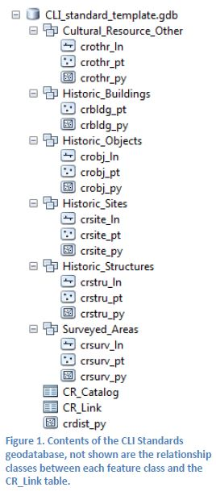
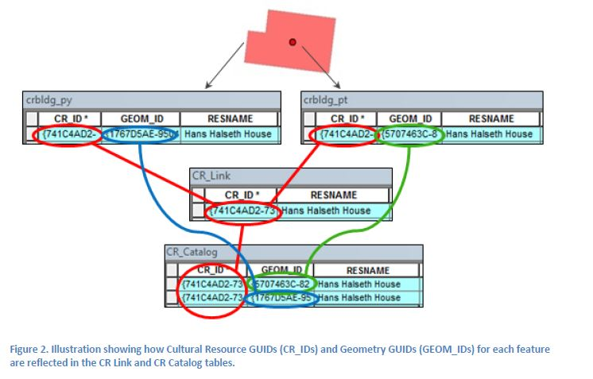
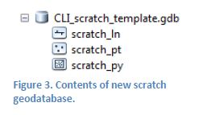
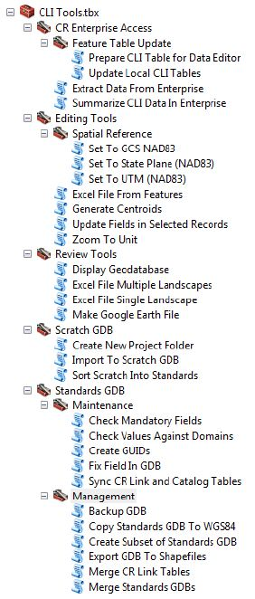

### About the CLI Toolbox

#### Preface

The CLI Toolbox is tailored to the specific needs of NPS Cultural Landscapes Program staff working with GIS data. The tools are designed to facilitate the creation of GIS data for new cultural landscapes, as well as the analysis and improvement of existing landscape GIS data that resides in the CR Enterprise spatial database, which is served throughout the NPS network. Because direct edits to the NPS CR Enterprise database can only be made by the designated regional data editors, this toolbox is intended as a way for Cultural Landscapes Program staff to create or improve data that will be easy for the data editors to improve the CR Enterprise.

Beyond the Cultural Landscapes Program, the CLI Toolbox also aims to facilitate broader adoption of the NPS CR Spatial Data Transfer Standards within the NPS.

*TECHNICAL NOTE: Throughout this document, any mention of a “geodatabase” refers to an ESRI file geodatabase (\*.gdb), not an MS Access-based personal geodatabase (\*.mdb).*

#### Acknowledgements

The creation of the CLI Toolbox was greatly aided by the following NPS staff:
Deidre McCarthy and Matt Stutts (CR-GIS), Tim Layton (OCLP), Allen McCoy, Susan Dolan, and Julia Yu (PWRO-Seattle), Vida Germano (PWRO-San Francisco), Angie Southwould (AKRO), Cassidy Van Beek (MWRO), Tom Gwaltney, Janice Vogel, and Mike Commisso (NCRO), and Andras Nagy (NCPTT)

### PART 1: Background Information

#### Project Background

These tools and guidelines are the result of the CLI Legacy GIS Conversion project that was conducted from October 2012 to October 2014. The project was funded by the Cultural Resource GIS Facility in WASO, and carried out by GIS staff Adam Cox and Andras Nagy while based at the National Center for Preservation Technology and Training in Natchitoches, Louisiana.

The objective of the project was to create an NPS CR Spatial Data Transfer Standards compliant geodatabase of all the features in the Cultural Landscape Inventory (CLI) that had been listed in completed CLI units (herein generally referred to as “landscapes”) by November, 2012. The ultimate goal was the inclusion of spatial data for CLI features in the NPS CR Enterprise database.

From the outset, the following rules were used to define the scope of work for the project:

- The Alaska Region CLI features would not be included as the AKRO GIS staff was tackling the same project on their own.
- Landscapes would only be included if their Inventory Status in the CLI had been marked as “Complete” by November 2012.
- Officially, only Contributing features would be included, though if convenient, Non-Contributing or Undetermined features may be included as well. (At first, all features were expected to be included, until this clearly became an unrealistic goal.)
- Though there are many features described in each landscape, only features that have been listed individually in the CLI would be included (for more information on what this means, see “About the Cultural Landscape Inventory” on ??? page ??? ).

Using these guidelines, the scope of work for the legacy project included approximately 22,000 features in approximately 650 landscapes. While creating data for all of these features and landscapes, many Python scripts and ArcGIS tools were created in order to:

- Accommodate the complex nature of the CLI database
- Create data that conforms to the NPS CR Spatial Data Transfer Standards

The CLI Toolbox is an aggregation of these tools and scripts into a well-ordered and well-documented ArcGIS toolbox, written in Python 2.7 for ArcGIS 10.1/10.2. It was compiled at the end of the legacy conversion project thanks to additional funding from the Olmsted Center for Landscape Preservation.

In creating this toolbox and the accompanying documentation, we hope to establish a protocol for the future creation and use of GIS data within the Cultural Landscapes Program. Though this guidance document can act as a strict procedural guide, it’s also important to keep in mind that these tools are designed for maximum flexibility; they function outside of the workflows described here, as well as outside of the CLI altogether.

#### About the Cultural Landscape Inventory

Very central to understanding how GIS will be used in the CLI, and ultimately incorporated into the NPS Cultural Resource Enterprise database, is the construction of the CLI database itself. At the most basic level, there are two types of objects from the CLI that are included in the GIS, features and boundaries.

--FEATURES--

Each landscape listed in the CLI has a 6-digit identifying number that identifies it as a unit. For example, the Port Oneida Historic District landscape has the number 500003. Within each landscape, features are divided into various categories of Landscape Characteristics, of which there is a potential universe of thirteen. Not all landscapes have significance in each of the potential Landscape Characteristics—for example, the inventory for Port Oneida Historic District only uses nine of the thirteen categories, as the cultural landscape of the Port Oneida Historic District retains integrity through nine Landscape Characteristics. Each Landscape Characteristic has a narrative description of features, as well as a table listing all of the individual features that fit within that category. Only when a feature is listed in one of these tables does it receive an Analysis Evaluation Features ID. This is also a 6-digit identifying number, and it is the most fine-grained level of catalog number for features in the CLI. Also, the features with an Analysis Evaluation Features ID are the only ones that can be reliably retrieved from the CLI database using a query.

What this means for GIS: only features that have been listed in the table for a given Landscape Characteristic have been given an Analysis Evaluation Features ID, and only features with an Analysis Evaluation Features ID can be incorporated into the NPS CR Enterprise database. Therefore, each feature included in this project has a three-tier level of characterization that must be preserved in the GIS. To accommodate this, the following fields are included in all CLI GIS data:

`CLI_NUM`    The CLI number for the landscape in which the feature is listed

`LAND_CHAR`  The Landscape Characteristic category in which the feature is listed

`CLI_ID`     The Analysis Evaluation Features ID given to the feature itself

As an example, the feature “Maple Tree Rows” in the Port Oneida Historic District has the following attributes: CLI_NUM = 500003, LAND_CHAR = Vegetation, CLI_ID = 105248.

--BOUNDARIES--

In the CLI, the boundaries of landscapes are not listed as “features” in the way described above, and therefore, they do not have Analysis Evaluation Features IDs. To deal with this in GIS, their `CLI_ID` will be set to equal their `CLI_NUM`, and their `LAND_CHAR` will be Boundary. Thus, the boundary polygon for Port Oneida Historic District would have the following attributes:

CLI_NUM = 500003, LAND_CHAR = Boundary, CLI_ID = 500003.

One can also think of landscape units and their boundaries as sitting in a three-tiered hierarchy: There is the landscape, the park that contains the landscape, and the region that contains the park. For example, Port Oneida Historic District is positioned thusly: Midwest Region>SLBE >500003. To combine this with the feature example above, the full lineage of the “Maple Tree Rows” could be shown as:
Midwest Region>SLBE>500003>Vegetation>105248.

It is important to note that in some cases, a given landscape is designated in the CLI as a component landscape that fits within a larger parent landscape. Because this is not a relationship that applies to all landscapes, and because parent landscapes and component landscapes both have their own CLI numbers and their own sets of features, this parent/component relationship is not built into the three-tiered hierarchy that is found in the toolbox.

#### About the NPS CR Spatial Data Transfer Standards

The CLI Legacy Conversion project was based on the use of the NPS CR Spatial Data Transfer Standards, as defined by the v2 documentation released by CR-GIS in January, 2014. These standards are a set of attributes designed to track the creation and lineage of cultural resource spatial data in the NPS. In addition to documenting the transfer standards, CR-GIS also designed a geodatabase schema that is based on them, which is intended as an implementation model for the transfer standards. The January 2014 documentation describes both the transfer standards themselves, as well as the implementation model. This documentation is included with the CLI Toolbox (document named “CulturalResourceStandards_Guidelines_v2.pdf”), and can be found on IRMA as well (https://irma.nps.gov/App/Portal/Topics/Cultural, follow the “Cultural Resource Digital Layer Standards” link).

The implementation model is also the foundation of the schema of the NPS CR Enterprise database that is served through the NPS network. Because the ultimate goal of the CLI Legacy Conversion project was to upload the CLI spatial data to the CR Enterprise database, using the geodatabase implementation model was imperative to making this process easy.

However, there are a few additions that were made to the implementation schema to accommodate the unique nature of the CLI database, which result in a geodatabase template called the CLI Standards. This format is the basis for most operations in the CLI toolbox, and is described in more detail in the following pages.

#### About the CLI Standards Geodatabase

The CLI Standards Geodatabase is based very closely on the v2 Spatial Data Transfer Standards Geodatabase Implementation model that is described in the v2 transfer standards documentation released by CR-GIS in January 2014. The geodatabase comprises a set of feature classes (inside of feature class datasets) that are based on the National Register features types. Each feature class has all of the spatial data transfer standards fields, and the only significant addition to in the CLI Standards model are the CLI_ID, LAND_CHAR, and CLI_NUM fields which are described in the “About the Cultural Landscape Inventory” section above.

The feature types are:

Historic Sites (archeological sites…)

Historic Buildings (houses…)

Historic Structures (bridges…)

Historic Objects (statues…)

Other Cultural Resources (vegetation…)

Historic Districts (national register districts…)

Surveyed Areas (surveyed areas…)

The CLI Standards geodatabase contains two tables called “CR_Link” and “CR_Catalog.” These are non-spatial tables that serve to make connections between the spatial data and all of the various NPS CR programs that have documented them. For example, a house may be listed as a feature in the CLI, an entry in the National Register, as well as in the List of Classified Structures, and it will most certainly have a listing in FMSS, the NPS facilities management system. In such a case, the row in the CR Link table that holds the CR_ID for that house will list its CLI Feature ID, National Register Reference Number, List of Classified Structures Number, and FMSS Asset Code. This allows for a linkage between various cultural resource databases. See the next section for a more detailed description of how these two tables interact.

When landscape GIS data is in this geodatabase schema, many useful operations can be carried out on it. For example, one may display all of the features in a landscape based on their contributing status in the CLI, or one may export a Google Earth file that has all of the landscape features grouped and colored by their respective landscape characteristic. Most importantly, this schema is very close to that of the NPS CR Enterprise database, so this will be an easy format for data editors to deal with when uploading new landscape data to the Enterprise (see p. ????).

#### About the CR Link and CR Catalog Tables

Near the end of the CLI Legacy Conversion project, the addition of the CR Catalog table was made to the CLI Standards schema. The CR Catalog concept was developed by the Alaska Region, and is implemented in the NPS CR Enterprise database. This reconfiguration increases the ease with which a user can update the program IDs that are stored in the CR Link table (NRIS reference numbers, LCS numbers, FMSS numbers, etc.).

The way that the CR Link and CR Catalog tables work is very straight-forward, and is all based on the `CR_ID` and `GEOM_ID` that is stored for each spatial feature. You may want to review the document titled “Graphical Explanation of GUIDs” (in this documentation folder) before continuing.

Figure 2 shows how the CR_ID and GEOM_IDs for two spatial features that represent a single cultural feature (a house) are carried through from the spatial features to the CR Link table to the CR Catalog. When the CR Link and CR Catalog work in conjunction like this, there is one line per CR_ID in the CR Link table, and one line per GEOM_ID in the CR Catalog. That means that if a new program ID needs to be assigned to this house (say, an LCS ID), it need only be added to the single corresponding line in the CR Link table.

Put another way: the CR Link table lists all of the CR_IDs and their associated program IDs, while the CR Catalog lists all of the GEOM_IDs and their associated CR_IDs.

For more information on the way the CR Link tables and CR Catalog tables are constructed, see pp. 54, and 73-74 of the Cultural Resource Spatial Data Transfer Standards v2 documentation.

#### CLI Toolbox Key Concepts
The following are elaborations on a few important concepts that are integral to the design and implementation of the tools in the CLI Toolbox.

--DIRECTORY STRUCTURE--

  
Based on the way that landscapes are inventoried in the CLI program, a very simple directory structure is recommended when creating and maintaining landscape GIS data. Below, A) is a specific example, and B) is the generic form:

A) C:\CLI_GIS\Midwest Region\SLBE\500003

B) <drive letter>:\CLI_GIS\<region name>\<park alpha>\<CLI number>
  
One advantage to using this structure is that it keeps all data related to a single landscape in the same folder. Another is that it is entirely scalable. If you begin with one landscape in one region, and a year later begin work on another landscape in a different park or region, you will not have to move files or rename any folders. Just use the **_Create New Project Folder_** tool for every landscape, and a network of landscape folders will begin to form. Keeping a set directory structure and standardized file names makes maintenance and tracking a much simpler task. However, with the understanding that various offices will have their own data storage protocols, the tools in this toolbox are designed for flexible applications, and do not require that your landscape directories are structured this way. They only encourage it.

--SCRATCH GEODATABASE--

The scratch geodatabase is designed to aid in the importation and creation of standards compliant spatial data. The intended use for the scratch geodatabase is to have one in each landscape directory, named with the landscape number. (This is automatically created with the Create New Project Folder
tool.) However, a scratch geodatabase could be placed anywhere, and data imports and exports will work just the same.

By default, the scratch geodatabase contains a blank point, line, and polygon feature class, each of which already has all of the standards fields with the correct domains assigned. The scratch geodatabase serves two purposes:

   A. As a place to which existing datasets can be imported and modified before sorting their features into the CLI Standards geodatabase.
   
   B. As a place to draft new features in the basic point, line, and polygon scratch feature classes before they are sorted to the various feature classes in the CLI Standards geodatabase.
     
For more information on the scratch geodatabase and its recommended uses, see the guidelines on creating new and importing existing data. Having a separate scratch geodatabase for each landscape was immediately necessary during the legacy conversion project, as work was always in an “in-progress” state on many, many landscapes.

--CLI LOOKUP TABLES--

Behind many of the functions used in these tools are two master tables, which are located inside of this tool package (CLI Toolbox\scripts\clitools\bin\CLI_InfoTables.gdb\<tables>). These tables serve as reference lists for 1) all of the features in all of the completed cultural landscapes and 2) all of the completed cultural landscapes units (as of this writing, these tables have approximately 33,000 and 750 rows, respectively). From these tables all sorts of information can be gathered: the list of expected features for a landscape, the list of completed landscapes in a park, the landscape characteristic and contributing status of any given feature, the park in which a landscape is located, etc.

These tables can only contain a snapshot of the CLI database (which continues to grow with the landscape program), so strategies have been devised to make their maintenance as easy as possible. A version of the tables, in the form of one, consolidated table that holds all information, will be served through the NPS CR Enterprise database. This table is called CLI_Feature_Table, and the **_Update Local CLI Tables_** tool, when run from the CR Enterprise Access map document, will pull all information from this table and update the user’s local versions of the tables. The majority of users will only ever need to perform this operation periodically to keep their tables up-to-date.

In order to keep the CLI_Feature_Table on the CR Enterprise as up-to-date as possible, the document “Updating the CLI Feature Table” explains how to query the CLI database and prepare a new CLI_Feature_Table that a designated data editor can use to update the master table in the Enterprise. This is an operation that only one person should do every few months, but it will need to be coordinated with the data editor. For the most industrious users, an alternative to using the **_Update Local CLI Tables_** tool would be to follow the “Updating the CLI Feature Table” guide, run the **_Prepare CLI Table for Data Editor_** tool as directed, and also check the “Update Local Tables?” box. This will transfer your newly prepared queries from the CLI into your local toolbox tables, bypassing the Enterprise table altogether. This would be necessary if one has added a new completed landscape to the CLI, and would like to have it (and its features) show up in the local tables that the toolbox uses.

Ultimately, the regular user of this toolbox need not touch these tables at all. However, it is important to understand that all landscape feature counts, resource names, CLI numbers, contributing statuses, landscape characteristic values, and park information come from these tables, which in turn come as straight exports from the CLI. Thus, if you find that a feature seems to be in the wrong landscape characteristic in the GIS, or it has an incorrect resource name, it’s because of the way it is entered in the CLI.

--ORGANIZATION OF THE CLI TOOLBOX--

The tools in the CLI Toolbox are split into 5 toolsets. Each set of tools is geared toward a certain type of usage. However, many workflows may include tools from various toolsets. The following is a quick description of each toolset:

- *CR Enterprise Access*
  These are tools designed to interact with the NPS CR Enterprise Database. This is a database that acts as a repository for all NPS cultural resource spatial data. The Feature Table Update toolset has two tools to assist with the maintenance of the CLI Lookup tables (see p.???). These tools must be run from ArcMap, using the CR Enterprise Access map document that is included in this installation.
- *Editing Tools*
  These tools are designed to assist with various data creation and editing tasks that will be common throughout the spatial data creation process. They must be run from ArcMap, not ArcCatalog.
- *Review Tools*
  This toolset contains a few tools that were created to assist in summarizing and reviewing the GIS data. Tools will display a geodatabase using preset layer and symbology schemes, create spreadsheet summaries of the progress of landscapes, or make Google Earth format versions of landscape data. These tools can be run from either ArcMap or ArcCatalog, besides Display Geodatabase, which must be used in ArcMap.
- *Scratch GDB*
  These tools provide a set of operations that are geared toward the use of the intermediate scratch geodatabase, which is designed to help with the conversion to and creation of standards-compliant spatial data. These tools can be run from either ArcMap or ArcCatalog.
- *Standards GDB*
  These tools assist in the final steps of creating and maintaining a CLI Standards geodatabase, as well as operations that are used to manage these geodatabases as a whole. These tools can be run from either ArcMap or ArcCatalog.

Figure 4. Full contents of CLI Toolbox. For an explanation of each tool, see Appendix B or each tool's help documentation.
