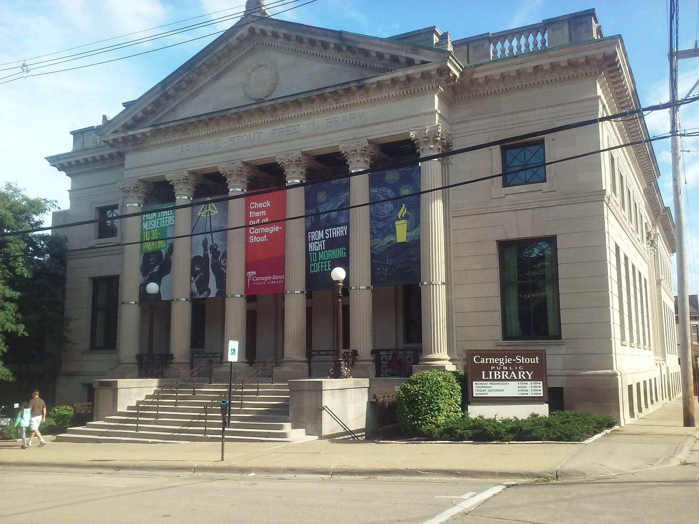

### About the CLI Toolbox

This is a collection of ArcGIS tools that has been built to facilitate the creation and maitenance of GIS data in the Cultural Landscape Inventory.

Example of image:

example of link
[google](https://google.com)
