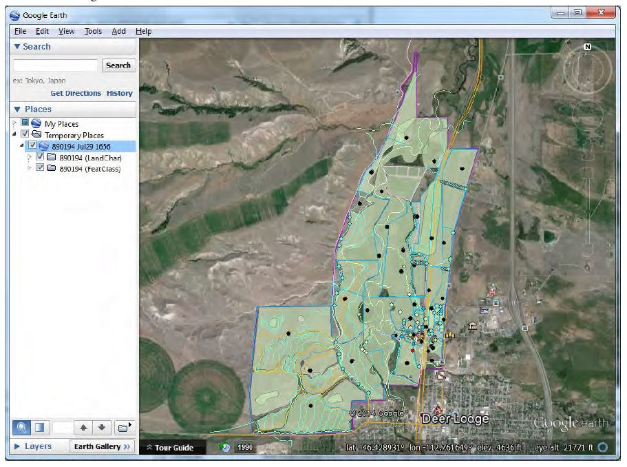
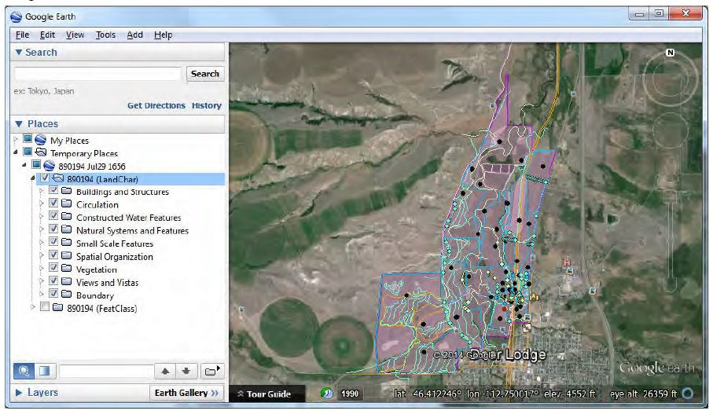
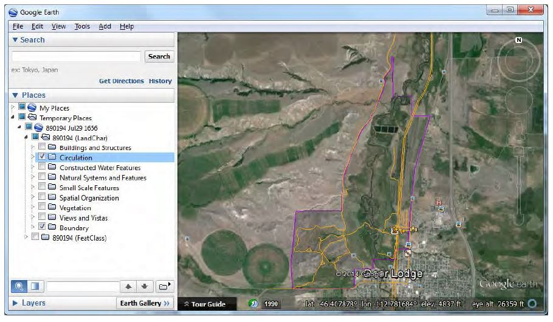
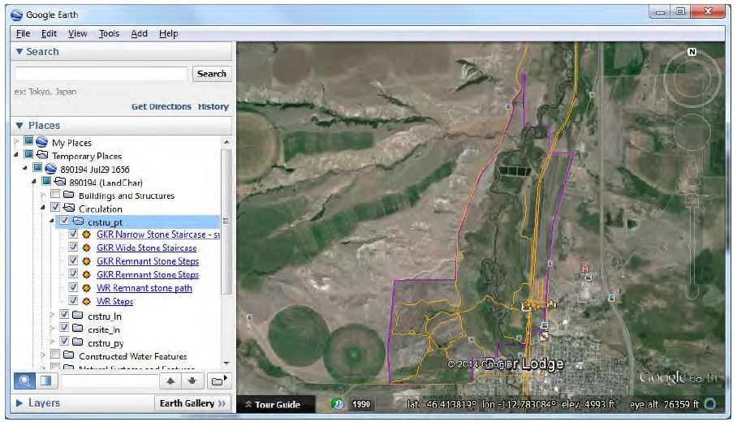
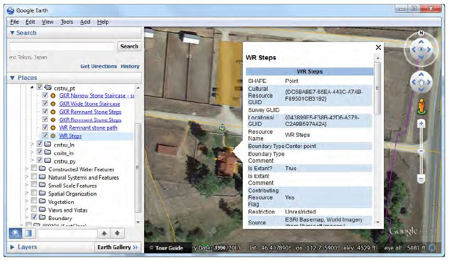
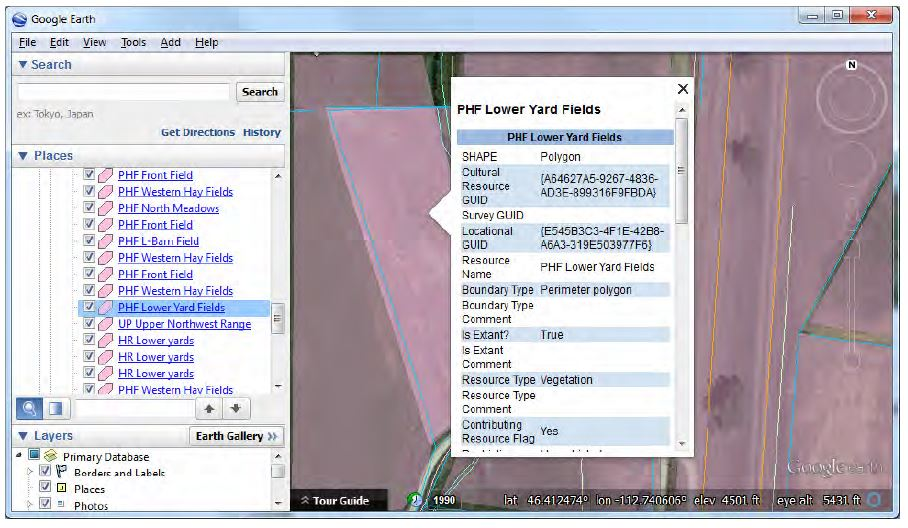
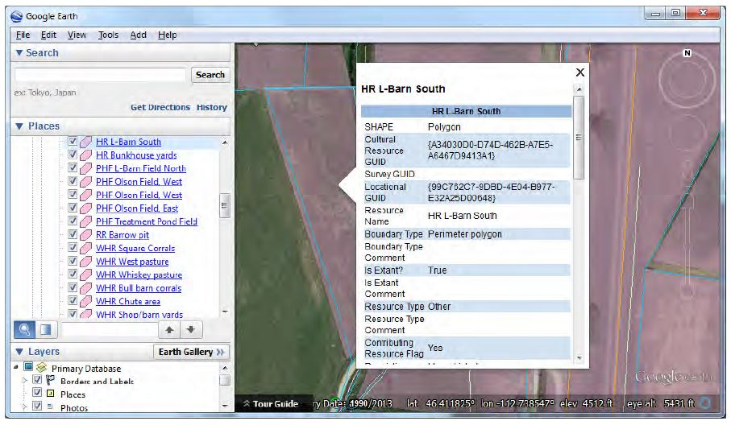

# Tips for Using CLI Google Earth Files
8-13-2014 | *Adam Cox*

The Google Earth file (KMZ) for the landscape has been created with some very specific layering and symbology schemes in mind. To take advantage of this, you will need to use the Places section of the Sidebar on the left. With the View menu you can ensure that the sidebar is visible.

Once you have opened the KMZ file in Google Earth, the file and its contents will be in the Temporary Places folder. See image below.

In the sidebar, you’ll be able to expand the contents of the KMZ file to see all of the subfolders and layer groups within it. The image above shows the Grant-Khor Ranch. Note that the first two sub-folders are called *LandChar* and *FeatClass*. These are two different symbol schemes that you may have available: *LandChar* groups and colors the features based on their Landscape Characteristic designation in the CLI, and *FeatClass* groups and colors the features based on where the feature is stored in the NPS CR spatial data transfer standards implementation model (these distinctions are based on National Register resource types). The layer scheme of the KMZ depends on the settings that were used in the *Make Google Earth* file tool.
For reviewing the CLI features, it is recommended that the reviewer make use of the *LandChar* symbology/layer scheme. You can expand the *LandChar* folder to show the groups based on CLI Landscape Characteristic. See image below:

At this point the reviewer can easily select specific Landscape Characteristics to inspect more closely, like Circulation, as shown below.

To get even more fine-grained detail, the Circulation folder can be expanded, which will show all of the feature classes that hold features that are Circulation features, and inside each of these is the actual feature itself. Inside each feature is a very small Russian doll. See below.

The names shown are taken straight from the CLI. To zoom to a feature just double click on it in the sidebar. Let’s see where the WR Steps are.

The popup that comes with the zoom is all of the CR spatial data transfer standards required fields that pertains to this feature. Generally, this information is related to how the actual spatial data was collected, not qualitative information about the CLI feature itself. You can also get this popup by clicking on the feature where you see it in on the map itself.

Further tips:

- It’s recommended that you turn off the boundary feature when trying to get information by clicking on features on the map. Often, the boundary polygon popup will happen when you are trying to click on another feature.

- For overlapping features, you can turn off individual features themselves. See the following two images, where the user 1. clicked on the feature PHF Lower Yard in the map, and then 2. turned that feature off and got the name of the one underneath it.

**Step 1.**

**Step 2.**

- You can take advantage of Google Earth’s 3D terrain modeling to great effect—especially useful for visualizing Views and Vistas. In the map, click and hold down the scroll-wheel in the middle of your mouse. With the scroll-wheel held down, moving the mouse up and down will alter the angle of your view, and left to right will rotate the view. It’s a little tricky at first, but will become easy quickly.

- To reorient the map so north is up, just click on the N in the compass at the top right corner.

- To enter street view, click on the person in the top right corner. Hold the mouse button down, and you’ll be able to see where street view is available, shown as thick blue lines. Drag the person icon onto one of the streets and you will enter street view.

- Make sure that photos are turned on in the Layers section of the Sidebar. These are all user submitted photos, and sometimes very useful for locating things.
